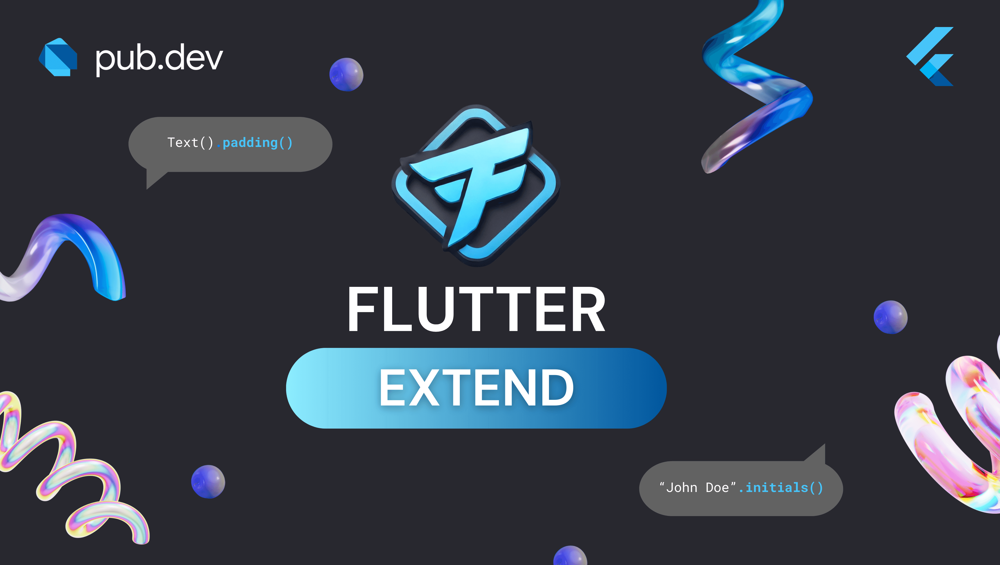
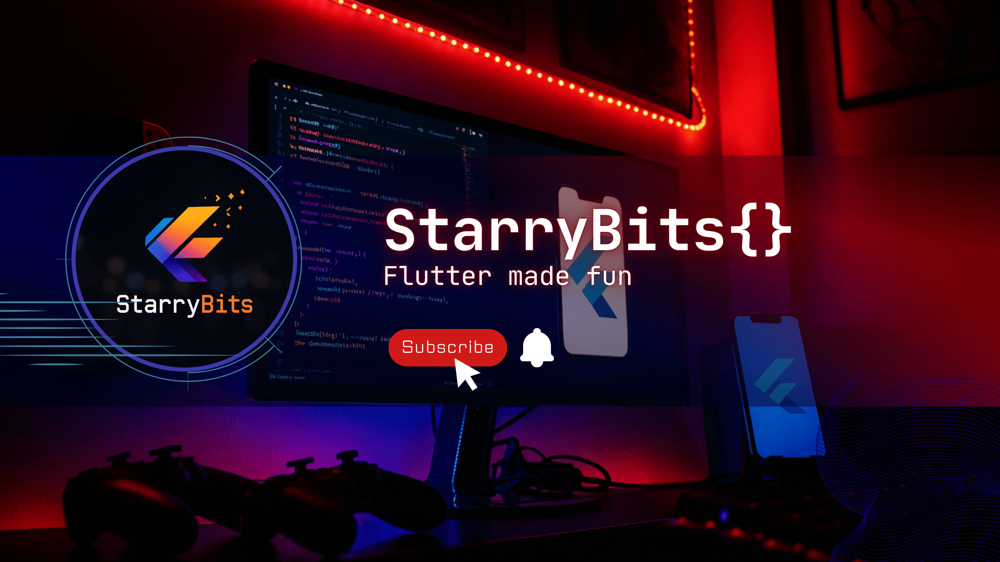

## Flagship Project

Flow V2 represents the intersection of design and functionality. It is not just a music player; it is a theming engine for your audio.

<Frame hint="Flow v2" caption="Beautifully-Themed Music Player">
    
</Frame>

<CardGroup cols={2}>
  <Card title="View Flow Documentation" icon="book-open" href="#">
    Learn how to customize and integrate Flow into your daily drive.
  </Card>
  <Card title="Get the App" icon="google-play" href="https://play.google.com/store/apps/details?id=com.kenstarry.flow&pcampaignid=web_share">
    Download the latest stable release of Flow Music Player.
  </Card>
</CardGroup>

## The Developer Ecosystem

Tools and resources curated to help you build better Flutter apps, faster.

<CardGroup cols={2}>
  <Card
    title="Flutter Extend"
    icon="box-open"
    href="/flutter_extend_docs/introduction"
  >
  
    The essential utility package to supercharge your code productivity.
  </Card>

  <Card title="StarryBits Tutorials" icon="youtube" href="#">
    
    Deep dives into Flutter internals, UI challenges, and best practices.

    <Badge color="green">Coming Soon</Badge>
  </Card>

</CardGroup>

## Latest from the Blog

<CardGroup cols={3}>
  <Card title="Multi-Wayed SVG Styling" icon="layer-group" href="/blogs/flutter/multi-wayed-svg-styling">
    Multiple approaches to styling SVGs in Flutter.
  </Card>
</CardGroup>

